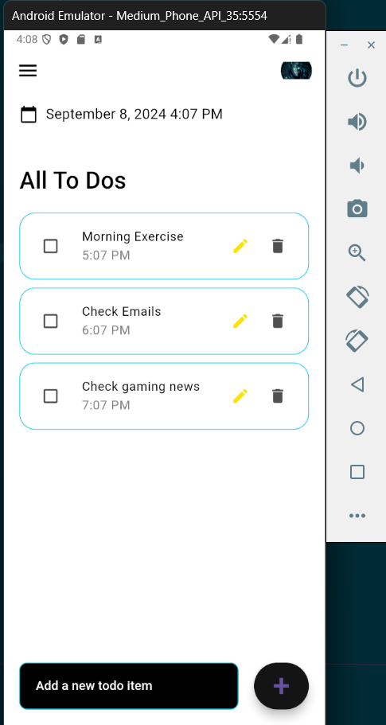

# Project Title: Flutter To-Do List App

Description:

The Flutter To-Do List App is a comprehensive task management application designed to help users organize their daily activities efficiently. This app features a clean and intuitive interface, allowing users to add, edit, and delete tasks with ease. Key functionalities include:

Task Management: Users can add new tasks, each with a description and a specific time. Tasks can be edited or deleted as needed.
Checkboxes: Each task includes a checkbox that users can check off upon completion, providing a visual indication of completed tasks.
Date and Time Display: The app displays the current date and time at the top of the screen, formatted in a 12-hour format, along with a calendar icon for easy access to date-related features.
Time Picker Integration: When adding or editing tasks, users can select a specific time using a built-in time picker. This feature ensures that each task can be associated with a precise time.
Customizable UI: The user interface includes a white background with light gray and cyan accents. Text fields and buttons are styled to ensure readability and accessibility.

## Features
- Add tasks
- Delete tasks
- Edit tasks
- Task completion with a cross-out

## Screenshot

## Animated Overview

